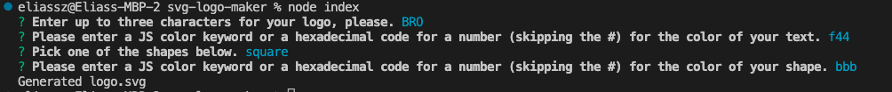

# SVG Logo Maker

## Description

This project was an exploration into how SVG files work, as well as into continued practice with Node.js. It also serves as a first repo implementing tests to test the results of my work, utilizing the npm package Jest.

## Installation

You will need to clone the github repo, make sure that you have Node installed(pre version 18) as well as inquirer (pre version 9).
## Usage

To use, once all npm packages are installed and configured (script in package.json should have "test": "jest"), run node index to activate inquirer. npm test will also utilize the test suite available.

## Credits

Thanks to [Bob Space's gitHub repo](https://gist.github.com/bobspace/2712980) for a handy-dandy object of CSS colorwords.

Thanks to [Antal Spector-Zabusky](https://gitlab.com/antalsz) for extra OOP tutorial, despite him being a functional programmer.

Thanks to [this Medium article](https://medium.com/factory-mind/regex-tutorial-a-simple-cheatsheet-by-examples-649dc1c3f285) for a crashcourse in RegEx.
